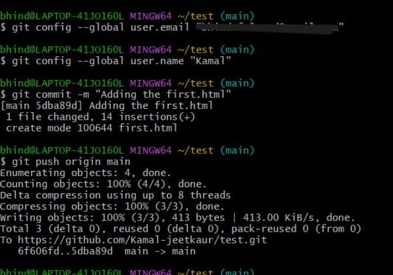

## Introduction to Git and Version Control:

### What is Git and Why Use Version Control

* **Git** is a **distributed version control system** used to track changes in source code during software development.
* It helps manage code across multiple versions, developers, and updates.
* **Version control** allows:

  * Tracking changes over time
  * Restoring previous versions of files
  * Collaboration among multiple developers without conflicts
  * Safe experimentation with new features

### Git Architecture

**1. Repository (Repo)**

* A **storage area** where Git tracks all file changes
* Can be:

  * **Local**: on your computer
  * **Remote**: on platforms like GitHub, GitLab

**2. Working Tree**

* The actual files and directories you're currently working on in your system
* Reflects the current state of your code
* You make changes in the working tree before committing them

**3. Index (Staging Area)**

* A **temporary area** where you add files before committing to the repo
* It allows you to prepare exactly what will go into the next commit
* Acts as a buffer between the working directory and the repository

## How to use Git? (With Command Line)

1. Create a repository 

2. Copy the HTML line of the repo 

3. Go to Git Bash

4. Run command: `git clone link`

5. Check if you got the repo cloned on your local dive by `ls`

6. Move inside the direcotry by `cd repo_name`

7. Check the content inside your repo (optional)

8. Check status of the repo by `git status`
   * If the response id 'Up to date', you are good to move forward

9. Create a new file by `touch file_name.html`

10. Open the file by `nano file_name.html`, write your code and save it. 

11. Add by: `git add file_name.html` 

### Warning Explained:

> `warning: in the working copy of 'first.html', LF will be replaced by CRLF the next time Git touches it`
- Right now the file has Unix-style (`LF`) endings, but since im on Windows, Git may convert it to Windows-style (`CRLF`) later.
- It's **safe to ignore**

12. `git push origin main`:
    - It directs and you get asked to authorize Git Credential Manager, which securely saves GitHub login credentials for pushing/pulling code.  
   
    

    - Click on 'Authorize git-ecosystem'
      
    
    
    - Enter your password
      
    

 14. To commit: `git commit -m "message"`
     
     - I haven’t set a Git identity yet, so git commit cannot proceed.
     - To fix this run:
     - git config --global user.name "name"
     - git config --global user.email "your-email@example.com" 
       > **email should match your Github email, but its not necessary for `name`** 
 15. Try `git commit -m "message"` again, and push this by command: `git push origin main`:
           
       

17. Now you can see the file in your repo:
    
