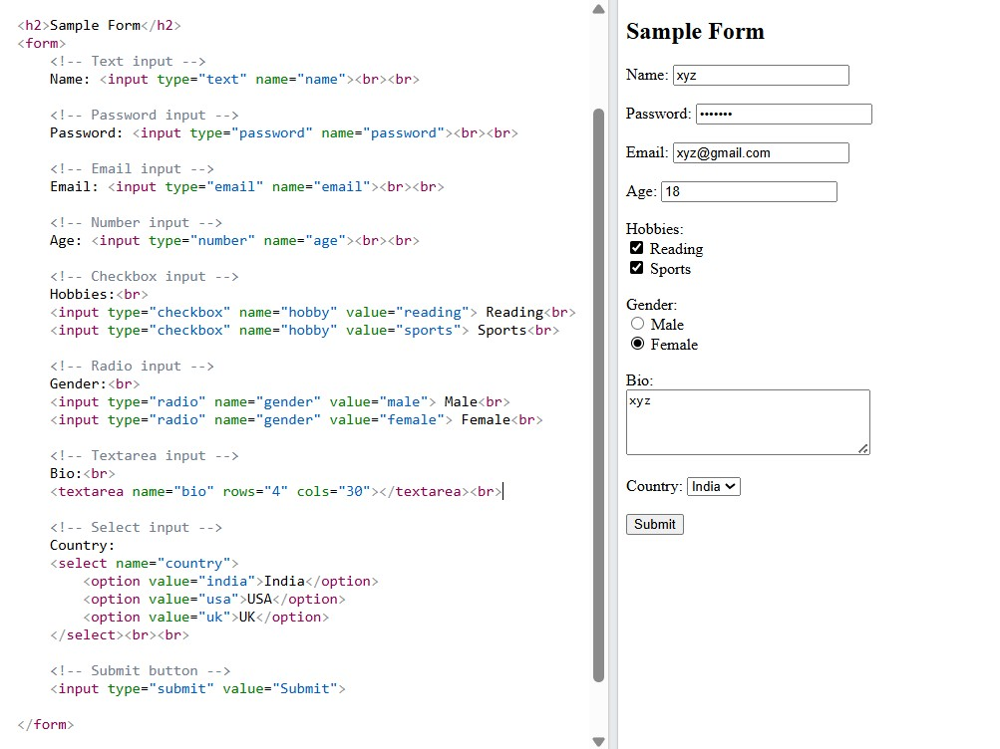

## Introduction to HTML & Web Basics

### Common HTML Tags

**1. Headings:**

* Tags: `<h1>` to `<h6>`
* `<h1>` is the largest, `<h6>` the smallest
* Used to define titles or section headers

**2. Paragraphs:**

* Tag: `
`
* Used to define a block of text (paragraph)
* Automatically adds spacing before and after

**3. Lists:**

* **Ordered List**: `<ol>` for numbered lists

  * Each item inside: `<li>`
* **Unordered List**: `<ul>` for bullet-point lists

  * Each item inside: `<li>`

**4. Links:**

* Tag: `<a href="URL">link text</a>`
* Used to create clickable hyperlinks
* Can link to external sites, internal pages, or email addresses

**5. Images:**

* Tag: ``
* `src`: source of the image
* `alt`: alternative text shown if image can't load

