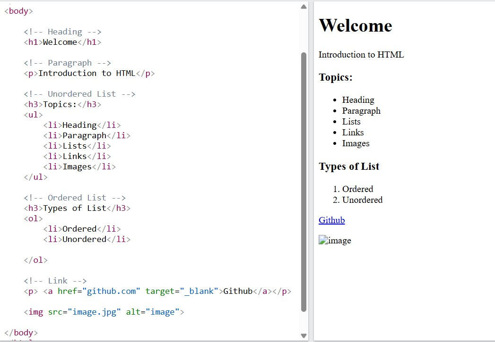

## Introduction to HTML & Web Basics

### Forms and Input Types:

* Forms allow users to **enter and submit data** to a server or script
* Tag: `<form>` – wraps all input elements
* Common **input types**:

  * `<input type="text">` – single-line text field
  * `<input type="password">` – hides text for passwords
  * `<input type="email">` – for email input (validates format)
  * `<input type="number">` – numeric input only
  * `<input type="checkbox">` – select one or more options
  * `<input type="radio">` – select only one from a group
  * `<input type="submit">` – button to submit the form
  * `<textarea>` – for multi-line text
  * `<select>` – dropdown list of options
    
  

### Semantic HTML:

Semantic tags describe **meaning and structure**, making code more readable and accessible:

* `<header>` – top section of a page or article (often includes logo or title)
* `<footer>` – bottom section (copyright, contact info, links)
* `<nav>` – navigation links/menu for the site
* `<section>` – groups related content within a page
* `<article>` – independent content (like a blog post or news item)

